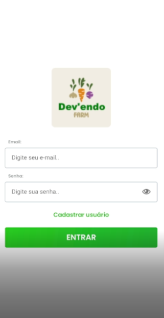
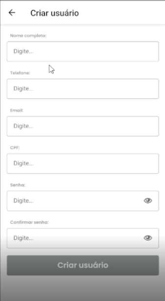

# Aplicativo em React Native

Bem-vindo ao repositório do aplicativo desenvolvido em React Native! Neste projeto, criei um aplicativo utilizando a poderosa biblioteca de desenvolvimento mobile, o React Native. O aplicativo é voltado para realização de login e cadastro para fazendeiros que querem doar seus alimentos ou pessoas que querem os alimentos, estou apenas testando o login e cadastro como funcionalidade para aprendizado.




## Funcionalidades Principais

Aqui estão algumas das principais funcionalidades que o nosso aplicativo oferece:

- Logar com e-mail e senha.
- Criar usuário.
- Telas Home e Perfil.

## Como Iniciar

Siga estas etapas para executar o aplicativo em sua máquina local:

1. **Clone o Repositório**: Comece clonando este repositório em sua máquina local usando o seguinte comando:

   ```bash
   git clone https://github.com/heenrYnog/DevFarm.git

2. Instale as Dependências: Navegue até o diretório do projeto e instale as dependências usando o gerenciador de pacotes de sua escolha (npm ou yarn):
   ```bash
   cd DevFarm
   npm install   # ou 'yarn install' se estiver usando Yarn
3. Necessário o back end para a aplicação rodar.
